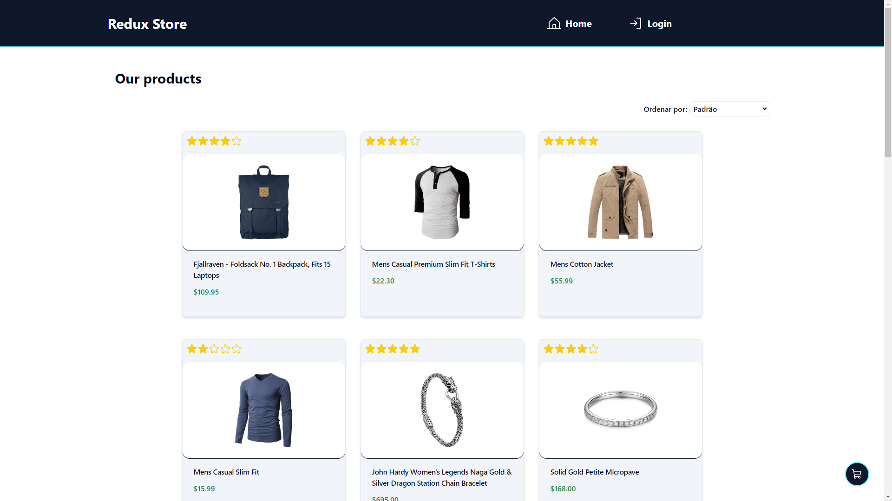

<h1 align="center"> React Movies </h1>

<p align="center">
  Bem-vindo ao projeto React Movies!<br/>
</p>

<p align="center">
  <a href="#-tecnologias">Tecnologias</a>&nbsp;&nbsp;&nbsp;|&nbsp;&nbsp;&nbsp;
    <a href="#-instalacao-do-projeto">Instalação do projeto</a>&nbsp;&nbsp;&nbsp;|&nbsp;&nbsp;&nbsp;
  <a href="#-sobre-o-projeto">Sobre o Projeto</a>&nbsp;&nbsp;&nbsp;|&nbsp;&nbsp;&nbsp;
  <a href="#-integrantes">Integrantes</a>&nbsp;&nbsp;&nbsp;

</p>

<p align="center">
  
</p>

## 🚀 Tecnologias <br id="-tecnologias">

Esse projeto foi desenvolvido com as seguintes tecnologias:

- Typescript
- React
- Tailwind
- Redux Toolkit
- Shadcn/ui
- Dayjs
- React Router Dom
- Phosphor-icons
- Zod
- React Hook Form
- API's (reqresApi, fakeStoreApi)

## ⚙️ Instalação do projeto <br id="-instalacao-do-projeto">

### Passo-a-passo:

#### 1. Clone o repositório para o seu computador usando o seguinte comando:

```bash
git clone git@github.com:andr3felipe/vemser-redux.git
```

#### 2. Navegue até o diretório do projeto:

```bash
cd vemser-redux
```

#### 3. Instale as dependências do projeto:

```bash
npm install
# or
yarn
```

#### 3. Inicie um servidor de desenvolvimento:

```bash
npm run dev
# or
yarn dev
```

## 💻 Sobre o Projeto <br id="-sobre-o-projeto">

Este projeto tem como objetivo simular um e-commerce, algumas das funcionalidades são:

- Listagem de produtos;
- Detalhar produto;
- Adicionar ao carrinho;
- Remover do carrinho;
- Alterar quantidade;
- Filtro de ordenação;
- Avaliar produtos;
- Registro;
- Login;
